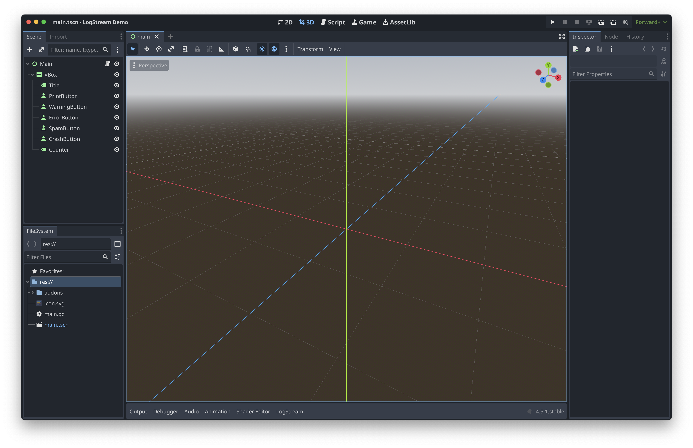

# Godot LogStream

[](https://godotengine.org)
[](LICENSE)

A powerful Godot 4.5+ Editor addon that captures engine logs, displays them in a dock panel, and streams them via WebSocket or file.

## 🧭 Current Repo vs. Challenge Plan
- **Current repo**: GDScript editor addon (Godot 4.5+), production-ready.
- **Challenge plan**: Fork `godotengine/godot` (C++) and build a **native LogStream subsystem** (brownfield, new language/ecosystem) with an engine-level log router, dock, file logger, and WebSocket server.
- Rationale: The engine fork satisfies the Uncharted Territory Challenge (brownfield, 1k+ stars, new tech, non-trivial feature). The addon remains as reference and UX baseline.



## ✨ Features

### 🔍 Log Capture
- Captures **all** engine output using Godot 4.5+ Logger API
- No need to replace `print()` calls or hack the Output panel
- Supports `print()`, `print_rich()`, `push_error()`, `push_warning()`
- Captures script errors with full stack traces
- Captures shader compilation errors

### 🎨 Dock Panel
- Real-time log viewer in the editor bottom panel
- **Color-coded** by severity (🔴 Error, 🟡 Warning, ⚪ Info)
- **Filter** by log level
- **Search** across messages, files, and functions
- **Click to copy** log entries
- **Double-click** file paths to open script at line number

### 🧭 Challenge (Engine Fork Plan)
- Fork `godotengine/godot` (C++) and add a native LogStream subsystem:
  - Engine-level log router with structured entries and ring buffer limits.
  - Built-in dock UI with severity filters, search, pause/clear, color coding, click-to-open.
  - File logger (JSONL/plain) with optional rotation.
  - Built-in WebSocket log server with batching and optional auth token.
  - Editor Settings under `logstream/*` to control buffers, sinks, and UI.
- Why it qualifies: brownfield, large codebase (~95k stars), new language/ecosystem, non-trivial end-to-end feature.

### 📁 File Logging
- Persistent log files with full timestamps
- Configurable path (`user://logstream.log` by default)
- Append mode for session continuity

### 🌐 WebSocket Streaming
- Stream logs to external tools in real-time
- Auto-reconnect on connection loss
- Batched JSON messages for efficiency (50 entries or 100ms)
- Perfect for remote debugging dashboards

## 📋 Requirements

- **Godot 4.5+** (uses the new Logger API)

## 📦 Installation

### From Asset Library
1. Open Godot Editor
2. Go to AssetLib tab
3. Search for "LogStream"
4. Click Install

### From GitHub
```bash
# Clone the repository
git clone https://github.com/yourusername/Godot-Logstream.git

# Copy to your project
cp -r Godot-Logstream/addons/logstream your_project/addons/
```

Then enable the plugin in **Project Settings → Plugins**.

## ⚙️ Configuration

Settings are in **Editor Settings** under `logstream/`:

| Setting | Default | Description |
|---------|---------|-------------|
| `max_entries` | 2000 | Maximum logs in memory (500-10000) |
| `websocket_url` | `ws://127.0.0.1:17865` | WebSocket server URL |
| `file_log_enabled` | true | Enable file logging |
| `file_log_path` | `user://logstream.log` | Log file path |
| `start_enabled` | true | Auto-start streaming on load |

## 🔌 WebSocket Protocol

LogStream sends batched JSON messages:

```json
{
  "type": "log_batch",
  "logs": [
    {
      "seq": 1234,
      "timestamp": "2025-12-04T15:32:10.123Z",
      "level": "error",
      "message": "Something broke",
      "file": "res://scripts/player.gd",
      "line": 42,
      "function": "_physics_process",
      "category": "script",
      "stack": ["res://scripts/player.gd:42 in _physics_process"],
      "project": "MyGame",
      "engine_version": "4.5.stable",
      "session_id": "abc123"
    }
  ]
}
```

## 🎮 Demo Project

A demo project is included in the `demo/` folder to test all features:

```bash
# Link the addon to the demo project
cd demo
ln -s ../addons addons

# Open in Godot
godot --editor project.godot
```

The demo provides buttons to:
- Print info messages
- Push warnings
- Push errors  
- Spam 100 mixed logs
- Trigger script errors with stack traces

## 🗺️ Engine Fork Plan (Brownfield Challenge)
- **Repo to fork**: `godotengine/godot` (C++).
- **Scope**: Engine-native LogStream (router, dock, file sink, WebSocket server) with Editor Settings.
- **Milestones**:
  - Day 1–2: Build setup, map logging pipeline, minimal C++ log capture POC.
  - Day 3–4: Router + ring buffer + file sink + settings.
  - Day 5: WebSocket server + batching + sample client.
  - Day 6: Dock UI polish (filters/search/pause/export/click-to-open).
  - Day 7: Docs (fork info, build/run), demo video, release build.
- **Deliverables**: Forked repo with clear commits, custom editor build instructions, updated README/architecture notes, demo video, daily log of AI-assisted work.

## 📁 Project Structure

```
addons/logstream/
├── plugin.cfg          # Plugin metadata
├── logstream.gd        # Main plugin entry point
├── log_entry.gd        # Log entry data class
├── log_buffer.gd       # Ring buffer implementation
├── log_capture.gd      # Logger API integration
├── log_router.gd       # Routes logs to sinks
├── file_writer.gd      # File logging sink
├── websocket_client.gd # WebSocket streaming sink
├── dock_panel.gd       # UI controller
├── dock_panel.tscn     # UI scene
├── icons/icon.svg      # Plugin icon
└── README.md           # Documentation
```

## 📄 License

MIT License - see [LICENSE](LICENSE) for details.

## 🤝 Contributing

Contributions welcome! Please open an issue or PR.


