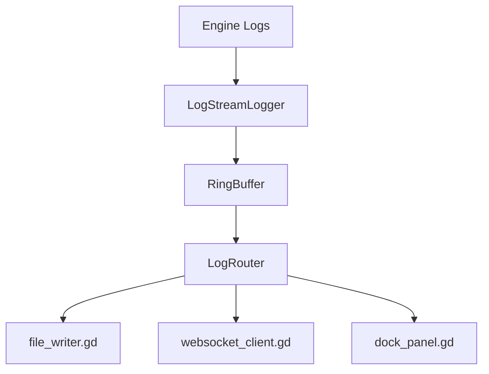

# System Patterns

## Architecture Overview
```
Engine Logs → LogStreamLogger → LogRouter → [FileWriter, WebSocketClient, DockPanel]
```

## Data Flow


## Key Components

### 1. LogStreamLogger (log_capture.gd)
- Extends `Logger` class
- Registers with `OS.add_logger(self)`
- Normalizes all log types to unified structure
- Emits signals for new logs

### 2. RingBuffer (log_buffer.gd)
- Fixed-size circular buffer
- Default 2000 entries (configurable 500-10000)
- O(1) insert, O(n) iteration
- Drops oldest when full

### 3. LogRouter (log_router.gd)
- Central dispatcher
- Routes logs to all registered sinks
- Manages sink lifecycle

### 4. Sinks
- **FileWriter**: Append-mode, optional rotation (post-MVP)
- **WebSocketClient**: Batched JSON, auto-reconnect
- **DockPanel**: UI display with filtering

## Log Entry Structure (Internal)
```gdscript
class LogEntry:
    var seq: int
    var timestamp: String  # ISO 8601
    var level: String      # "info", "warning", "error", "debug"
    var message: String
    var file: String
    var line: int
    var function: String
    var category: String   # "engine", "script", "other"
    var stack: Array[String]
```

## Design Decisions
1. **Autoload Pattern**: Plugin registers autoload for logger
2. **Signal-based**: Components communicate via signals
3. **EditorSettings**: All config in editor settings, not project
4. **Batching**: WebSocket batches for efficiency (50 entries / 100ms)


