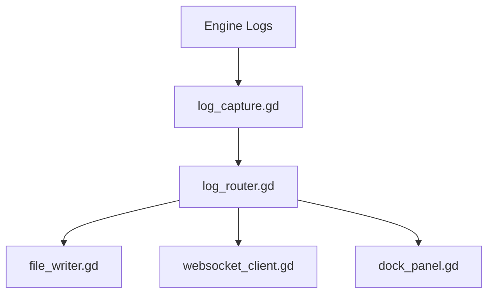

# Godot LogStream — PRD v2 (Concise & Developer-Friendly)

## 1. Overview
Godot LogStream is a Godot Editor addon that captures engine logs (errors, warnings, prints), displays them in a dock panel, and streams them externally via WebSocket or file logs. The plugin is packaged for the Godot Asset Library.

## 2. Goals
- Capture all engine log types.
- Display logs in a color-coded dock.
- Write logs to file.
- Stream logs over WebSocket with reconnect.
- Provide ZIP + Git URL installation.
- Meet Asset Library packaging standards.

## 3. MVP Features
### 3.1 Log Capture
- Intercept: print, errors, warnings, stack traces.
- Normalize log data structure.

### 3.2 Ring Buffer
- Store last N logs in memory.
- Prevent memory bloat.

### 3.3 Dock Panel (UI)
- Live stream view.
- Color-coded logs.
- Severity filters.
- Click-to-copy.
- Clickable file paths → open relevant script + line.

### 3.4 File Writer
- Append-mode writer.
- Optional rotation.

### 3.5 WebSocket Output
- Configurable endpoint.
- Graceful reconnection.
- Batch-send logs.

### 3.6 Settings Panel
Configurable:
- WebSocket URL
- Max logs
- Log file path

## 4. Directory Structure
```
addons/logstream/
  plugin.cfg
  logstream.gd
  log_capture.gd
  log_router.gd
  file_writer.gd
  websocket_client.gd
  dock_panel.tscn
  dock_panel.gd
  icons/icon.svg
  README.md
```

## 5. Packaging
- Provide ZIP of `/addons/logstream/`.
- Publish GitHub Repo with tags (v1.0.0).
- Provide icon + screenshots.

## 6. Asset Library Requirements
- Name: Godot LogStream
- Category: Editor Plugin
- License: MIT
- Godot version: 4.2+
- Description: concise + screenshots

## 7. Post-MVP (DO NOT IMPLEMENT YET)
- HTTP log receiver.
- External terminal integration.
- Remote debugging for device builds.

## 8. tasks.md
**Day 1–2**
- Create addon structure.
- Implement log_capture.gd + routing.

**Day 3**
- File writer + WebSocket client + reconnect.

**Day 4**
- Dock Panel UI + filters + color coding.

**Day 5**
- Click-to-copy + clickable file paths.

**Day 6**
- Settings panel, polishing, testing.

**Day 7**
- Prepare ZIP, README, screenshots, submit.

## 9. Mermaid Architecture


## 10. Deliverables
- Complete addon folder.
- README + screenshots.
- ZIP for AssetLib.
- GitHub repo + tagged release.
